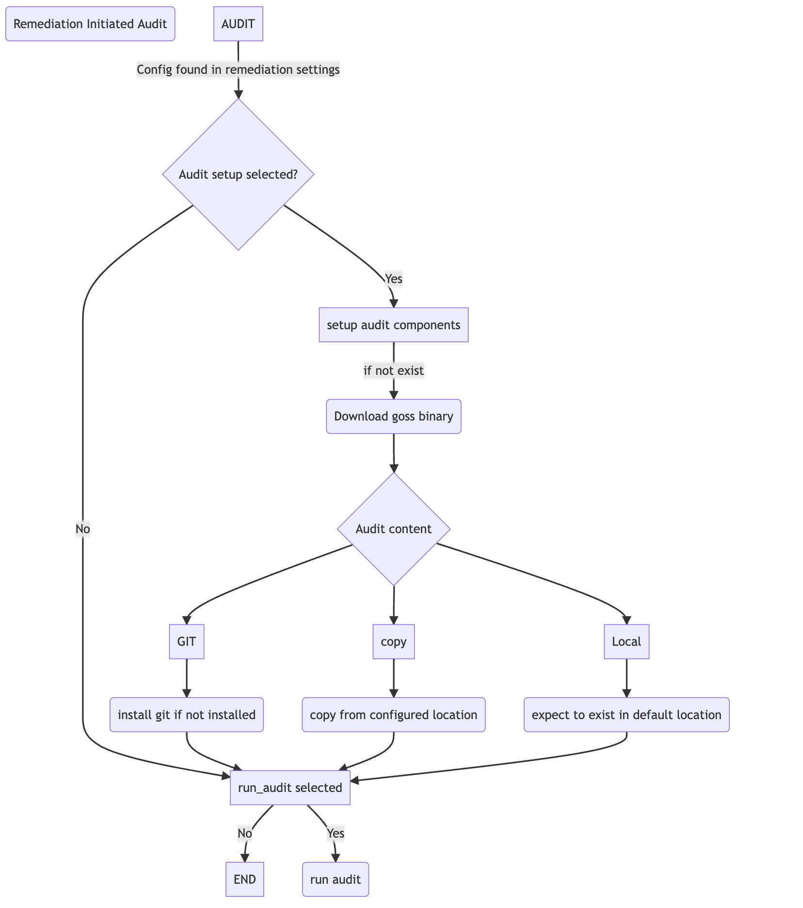

Using Audit and Remediate together
==========================================

Using both Audit and Remediate in a workflow

This is missing the copy remediate settings step

Post Hardening Lockdown Reporting via Ansible_Facts
===================================================

The `etc/ansible/compliance_facts.j2` template metadata and conditions related to hardening performed by the **Ansible Lockdown** role.

Lockdown Ansible_Facts: Creating Custom Compliance Facts
++++++++++++++++++++++++++++++++++++++++++++++++++++++++

The playbook conditionally creates a custom facts file on managed hosts to document the applied security benchmark and hardening levels.

`lockdown_role/tasks/main.yml`

.. code-block:: yaml

    - name: Add ansible file showing Benchmark and levels applied
      when: create_benchmark_facts
      tags:
        - always
        - benchmark
      block:
        - name: Create ansible facts directory
          ansible.builtin.file:
            path: "{{ ansible_facts_path }}"
            state: directory
            owner: root
            group: root
            mode: 'u=rwx,go=rx'

        - name: Create ansible facts file
          ansible.builtin.template:
            src: etc/ansible/compliance_facts.j2
            dest: "{{ ansible_facts_path }}/compliance_facts.fact"
            owner: root
            group: root
            mode: "u-x,go-wx"

Key Components
++++++++++++++

- **Conditional Execution**: The entire block executes only if the variable ``create_benchmark_facts`` is set to ``true``.

- **Tagging**: The tasks are tagged with ``always`` and ``benchmark``, allowing for selective execution during playbook runs.

- **Directory Creation**: Ensures the existence of the directory specified by ``ansible_facts_path`` (typically ``/etc/ansible/facts.d``), setting appropriate permissions.

- **Facts File Creation**: Uses a Jinja2 template to generate the ``compliance_facts.fact`` file in the specified directory.

Custom Facts in Role
++++++++++++++++++++

Ansible allows the use of custom facts to store host-specific information. These facts are typically stored in files within the ``/etc/ansible/facts.d``
directory on the managed hosts. The facts files can be in JSON or INI format and are loaded automatically during the fact-gathering phase.

Accessing Custom Facts
++++++++++++++++++++++

Once the custom facts are in place and facts have been gathered, they can be accessed in playbooks using the ``ansible_local`` variable.

.. code-block:: jinja

    {{ ansible_local.compliance.benchmark_version }}

Lockdown Facts Example:
-----------------------

Variables Used
--------------

- ``benchmark_version``: The version of the CIS/STIG benchmark being applied.
- **CIS** ``cis_level_1 | cis_level_2``: Booleans that indicate if level 1 or 2 hardening is enabled.
- **STIG** ``stig_cat1 | stig_cat2 | stig_cat3``: Indicate whether Category I, II, or III controls were enabled during the hardening process.
- ``ansible_run_tags``: List of tags used during the playbook run to identify scope
- ``run_audit``: Boolean to indicate if an audit was performed.
- ``audit_log_dir``: Path to local audit log directory on the node.
- ``post_audit_results``: Captured summary results from post-audit steps.
- ``fetch_audit_output``: Boolean flag to indicate whether audit logs were centralized.
- ``audit_output_destination``: Destination directory for centralized audit files.

CIS
+++

1. **[lockdown_details]**
  - Contains metadata about the CIS benchmark used, run date, and the hardening levels enabled.

.. code-block:: ini

  [lockdown_details]
  # Benchmark release
  Benchmark_release = CIS-{{ benchmark_version }}
  Benchmark_run_date = {{ '%Y-%m-%d - %H:%M:%S' | ansible.builtin.strftime }}

  # Hardening levels enabled via variables
  level_1_hardening_enabled = {{ rhel9cis_level_1 }}
  level_2_hardening_enabled = {{ rhel9cis_level_2 }}

  # Tag-based hardening run types (conditional)
  
  Level_1_Server_tag_run = true
  
  
  Level_2_Server_tag_run = true
  
  
  Level_1_workstation_tag_run = true
  
  
  Level_2_workstation_tag_run = true
  

2. **[lockdown_audit_details]**
  - Captures audit-specific information if auditing is enabled.

.. code-block:: ini

  [lockdown_audit_details]

  
  # Audit run
  audit_run_date = {{ '%Y-%m-%d - %H:%M:%S' | ansible.builtin.strftime }}
  audit_file_local_location = {{ audit_log_dir }}

  
  audit_summary = {{ post_audit_results }}
  

  
  audit_files_centralized_location = {{ audit_output_destination }}
  
  

3. **Output**

.. code-block:: ini

      ansible hosts -i ../inv -m setup -a "filter=ansible_local"
      hosts | SUCCESS => {
         "ansible_facts": {
            "ansible_local": {
                  "lockdown_facts": {
                     "Benchmark_Audit_Details": {
                        "audit_file_location_local": "/opt",
                        "audit_summary": "Count: 798, Failed: 24, Skipped: 6, Duration: 38.824s"
                     },
                     "Benchmark_Details": {
                        "benchmark_release": "CIS-v2.0.0",
                        "benchmark_run_date": "2025-03-31 - 14:59:43",
                        "level_1_hardening_enabled": "True",
                        "level_2_hardening_enabled": "True"
                     }
                  }
            },
            "discovered_interpreter_python": "/usr/bin/python3"
         },
         "changed": false
      }

STIG
++++

1. **[lockdown_details]**
  - Contains metadata about the STIG benchmark used, run date, and the hardening levels enabled.

.. code-block:: ini

  [lockdown_details]
  # Benchmark release
  Benchmark_release = STIG-{{ benchmark_version }}
  Benchmark_run_date = {{ '%Y-%m-%d - %H:%M:%S' | ansible.builtin.strftime }}

  # If options set (doesn't mean it ran all controls)
  cat_1_hardening_enabled = {{ rhel9stig_cat1 }}
  cat_2_hardening_enabled = {{ rhel9stig_cat2 }}
  cat_3_hardening_enabled = {{ rhel9stig_cat3 }}

  # Tag-based hardening run types (conditional)
  
  # If tags used to stipulate run level
  
  Cat_1_Server_tag_run = true
  
  
  Cat_2_Server_tag_run = true
  
  
  Cat_3_Server_tag_run = true
  
  

2. **[lockdown_audit_details]**
  - Captures audit-specific information if auditing is enabled.

.. code-block:: ini

  [lockdown_audit_details]

  
  # Audit run
  audit_file_local_location = {{ audit_log_dir }}

  
  audit_summary = {{ post_audit_results }}
  

  
  audit_files_centralized_location = {{ audit_output_destination }}
  
  

3. **Output**

.. code-block:: ini

      ansible hosts -i ../inv -m setup -a "filter=ansible_local"
      hosts | SUCCESS => {
         "ansible_facts": {
            "ansible_local": {
                  "lockdown_facts": {
                     "Benchmark_Audit_Details": {
                        "audit_file_location_local": "/opt",
                        "audit_summary = Count: 979, Failed: 73, Skipped: 22, Duration: 18.411s"
                     },
                     "Benchmark_Details": {
                        "benchmark_release": "STIG-v2r2",
                        "benchmark_run_date": "2025-03-31 - 14:59:43",
                        "cat_1_hardening_enabled": "True",
                        "cat_2_hardening_enabled": "True",
                        "cat_3_hardening_enabled": "True",
                     }
                  }
            },
            "discovered_interpreter_python": "/usr/bin/python3"
         },
         "changed": false
      }
