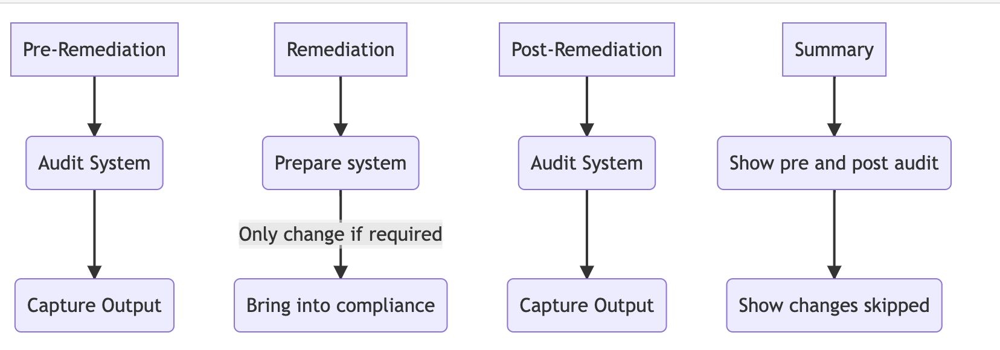

Automated Security Benchmark - Auditing and Remediation
=======================================================

Why should this role be applied to a system?
--------------------------------------------

There are three main reasons to apply this role to systems:

- Improve security posture

    The configurations from the adopted benchmark add security and rigor around multiple
    components of an operating system, including user authentication, service
    configurations, and package management. All of these configurations add up
    to an environment that is more difficult for an attacker to penetrate and use
    for lateral movement.

- Meet compliance requirements

    Some deployers may be subject to industry compliance programs, such as
    PCI-DSS, HIPAA, ISO 27001/27002, or NIST 800-53. Many of these programs require
    hardening standards to be applied to systems.

- Deployment without disruption

    Security is often at odds with usability. The role provides the greatest
    security benefit without disrupting production systems. Deployers have the
    option to opt out or opt in for most configurations depending on how their
    environments are configured.

What is security hardening?
---------------------------

The content delivered is based upon either one of the two major contributors to the security best practices in the IT industry.

- Center for Internet Security (CIS): `CIS <https://www.cisecurity.org/cis-benchmarks/>`_

  - A global IT community of experts helping to build, document sets of benchmarks to produce industry best security practices. 
    CIS Benchmarks are vendor agnostic, consensus-based security configuration guides both developed and accepted by government, business, industry, and academia.

or

- Security Technical Implementation Guide (STIG): `STIG <https://public.cyber.mil/stigs/downloads/>`_

  - From the Defense Information Systems Agency (DISA)
  - The STIG is released with a public domain license and it is commonly used to secure systems at public and private organizations around the world.

Both are well known and respected benchmarks created for the industry to assist in achieving recognised compliance (e.g. PCI DSS, HIPAA, SOC2, NIST) 
and adopting security best practices.

.. toctree::
   :maxdepth: 2
   :caption: Benchmark Overview

   CIS/cis_overview.rst
   STIG/stig_overview.rst

What is provided?
-----------------

The content provided is open source licensed configurations to assist in achieving or auditing compliance to one of the benchmark providers listed above.

This consists of two components

- Audit

  - runs a small single binary on the system written in go called `goss <https://goss.rocks>`_
  - enables you to very quickly scan your host and output the status of compliance for your host.

- Remediate

  - Ability to run from a central location using the configuration management tool ansible
  - Assists in bringing your host into compliance for the relevant benchmark

Both can be run alone or inconjunction with each other.

How is this written?
--------------------

We analyze each configuration control from the applicable benchmark to determine what impact it has on a live production environment and how to
best implement a way to audit the current configuration and how to achieve those requirements using Ansible. 
Tasks are added to the role that configure a host to meet the configuration requirements. Each task is documented to explain what was changed, 
why it was changed, and what deployers need to understand about the change.

Deployers have the option to enable/disable every control that does not suit their environments needs. 
Every control item has an associated variable that can be used to switch it on or off.

Additionally, the items that have configurable values, i.e. number of password attempts, will generally have a corresponding variable that allows for 
customization of the applied value.
It is imperative for each deployer to understand the regulations and compliance requirements that their organization and specific 
environments are responsible for meeting in order to effeectively implement the controls in the relevant benchmark.

Documentation
-------------

.. toctree::
   :maxdepth: 2
   :caption: Audit

   audit/getting-started-audit.rst
   audit/audit-faq.rst

.. toctree::
   :maxdepth: 2
   :caption: Remediate

   remediate/rem-getting-started.rst
   remediate/rem-faq.rst

.. toctree::
   :maxdepth: 2
   :caption: Combined

   combined/comb-getting-started.rst
   combined/comb-faq.rst

Available content
-----------------

.. toctree::
   :maxdepth: 2
   :caption: Benchmarks

   CIS/benchmarks_CIS.rst
   STIG/stig_benchmarks_STIG.rst
   STIG/STIG_table.rst

Contributing
------------

As with all opensource repositories to work community contributions from issues and pull requests.
We do however ask the following:

- respect the users, time and effort put into feedback
- try and provide as much information as possibke with issues or pull request.
- For Pull requests we do ask that:

  - signed-off-by (user is provided)
  - signed-by (gpg key signed)

.. toctree::
   :maxdepth: 2
   :caption: Development

   audit/audit_development.rst
   remediate/rem_development.rst

.. toctree::
   :maxdepth: 2
   :caption: Support

   support.rst

.. toctree::
   :maxdepth: 2
   :caption: Reference & Appendices

   glossary.rst
