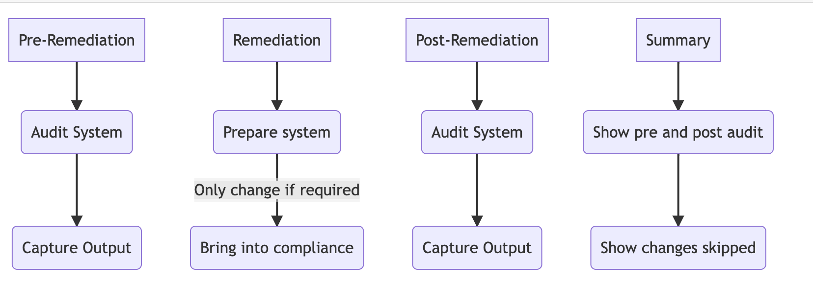

Automated Security Benchmark - Auditing and Remediation
=======================================================

.. image:: https://img.shields.io/github/stars/ansible-lockdown?label=Org%20Stars&style=social
  :target: https://github.com/ansible-lockdown

.. image:: https://img.shields.io/github/followers/ansible-lockdown?style=social
  :target: https://github.com/ansible-lockdown

.. image:: https://img.shields.io/discord/925818806838919229?logo=discord
  :target: https://discord.io/ansible-lockdown/

MindPoint Group's (MPG_) Ansible-Lockdown Overview
--------------------------------------------------
Our ReadtheDocs elaborates the resources, significance and objective of using our Automated Security
Benchmark for auditing and remediation of system security. Our MPG_ Ansible_ roles can be applied
to systems to improve security posture, meet compliance requirements, and deploy without disruption
after due diligence. Security hardening is achieved through the use of industry-recognized benchmarks
CIS_ and DISA_ STIG_, which provide open-source licensed configurations to bring systems
into security compliance. The content delivered consists of an audit component based on GOSS_
that scans a host for compliance and a remediate component that can be run centrally using an
**Ansible Deployment Server** to bring host(s) into compliance. Our open-source development/release process
composes of MPG_'s Ansible-Lockdown GitHub_ main/devel branches and ansible-galaxy_ updates that aligned
with new benchmark versions.

Why should this role be applied to a system?
--------------------------------------------

There are **three** main reasons to apply this role to systems:

- **1. Improve security posture**

    The configurations from the adopted benchmark add security and rigor around multiple
    components of an operating system, including user authentication, service
    configurations, and package management. All of these configurations add up
    to an environment that is more difficult for an attacker to penetrate and use
    for lateral movement.

- **2. Meet compliance requirements**

    Some deployers may be subject to industry compliance programs, such as
    PCI-DSS, HIPAA, ISO 27001/27002, or NIST 800-53. Many of these programs require
    hardening standards to be applied to systems.

- **3. Deployment without disruption**

    Security is often at odds with usability. The role provides the greatest
    security benefit without disrupting production systems. Deployers have the
    option to opt out or opt in for most configurations depending on how their
    environments are configured.

What is security hardening?
---------------------------
Based upon industry recognized benchmarks and best practices,
using leading products to enable highly adjustable configurations
to bring your systems/platforms into security compliance.

- Open-Source (MIT licensed)

  - Community supported as standard
  - Enterprise support available

- Configuration-as-code

  - Assist in bringing your systems/platform into compliance through the use of Ansible_
  - Audit your current system/platform using GOSS_

- Highly configurable to work with your systems

The content delivered is based upon either one of the two major contributors to the security best practices in the IT industry.

- **Center for Internet Security** (CIS_):

  - A global IT community of experts helping to build, document sets of benchmarks to produce industry best security practices.
  - CIS Benchmarks are vendor agnostic, consensus-based security configuration guides both developed and accepted by government, business, industry, and academia.

**or**

- **Security Technical Implementation Guide** (STIG_):

  - From the Defense Information Systems Agency (DISA_)
  - The STIG is released with a public domain license and it is commonly used to secure systems at public and private organizations around the world.

.. note::
  Both CIS_ and STIG_ are well-known and respected benchmarks created for the industry to assist in achieving recognized compliance (e.g. PCI DSS, HIPAA, SOC2, NIST) and adopting security best practices.

.. toctree::
   :maxdepth: 2
   :caption: Benchmark Overview

   CIS/cis_overview.rst
   STIG/stig_overview.rst

What is provided?
-----------------

The content provided is open-source licensed configurations to assist in
achieving or auditing compliance to one of the benchmark providers listed above.

This consists of two components:

- **Audit**

  - Runs a small single binary on the system written in GO called GOSS_.
  - Enables you to very quickly scan your host and output the status of compliance for your host.

- **Remediate**

  - Has the ability to run from a central location using the configuration management tool ansible.
  - Can assist with bringing your host into compliance for the relevant benchmark.

Both can be run alone or in conjunction with each other.

How is this written?
--------------------

We analyze each configuration control from the applicable benchmark to determine what impact it has on a live production environment and how to
best implement a way to audit the current configuration and how to achieve those requirements using Ansible.
Tasks are added to the role that configure a host to meet the configuration requirements. Each task is documented to explain what was changed, 
why it was changed, and what deployers need to understand about the change.

Deployers have the option to enable/disable every control that does not suit their environments needs.
Every control item has an associated variable that can be used to switch it on or off.

Additionally, the items that have configurable values, i.e. number of password attempts, will generally have a corresponding variable that allows for
customization of the applied value.
It is imperative for each deployer to understand the regulations and compliance requirements that their organization and specific
environments are responsible for meeting in order to effectively implement the controls in the relevant benchmark.

Development Process
-------------------

Lifecycle of releases and branches
^^^^^^^^^^^^^^^^^^^^^^^^^^^^^^^^^^

While Remediate and Audit are individually managed processes, nevertheless, some of the content is linked.
There are occasions where both need updating or just one of them.

As a rule, our goal is to abide to the following lifecycle process for branches and releases that include ansible-galaxy_ sync updates.
Being community, we have direct customer requests and requirements that take priority in releases.

Branches
^^^^^^^^

- **devel branch**

   - Staging area for bug fixes, PRs and new benchmarks.
   - Default and working development branch.
   - We aim to get majority of PRs merged to devel between 2-4 weeks.
   - Community Collaboration PR (Pull Request) Branch.

- **main branch** *(The release branch)*

   - We merge from devel to main branch.
   - main branch is dependent on the severity and impact of issues closed.
   - Routinely, a release alignment is every 8-12 weeks (sometimes much quicker).
   - Once a new CIS_/STIG_ benchmark gets released, we aim to merge the new tagged release (2-4 weeks).
   - The major releases are sourced and linked to ansible-galaxy_ Roles.

Demos
^^^^^

.. image:: https://img.youtube.com/vi/sbIfaNsoszM/maxresdefault.jpg
    :alt: Ansible Lockdown - RHEL 9 CIS Baseline Demo
    :target: https://www.youtube.com/watch?v=sbIfaNsoszM

.. image:: https://img.youtube.com/vi/5OdT3k2IDVo/maxresdefault.jpg
    :alt: Ansible Lockdown - M. Bolwell Audit and Compliance Benchmarks Demo/Q and A
    :target: https://www.youtube.com/watch?v=5OdT3k2IDVo

.. _Ansible: https://www.ansible.com/
.. _GOSS: https://goss.rocks
.. _STIG: https://public.cyber.mil/stigs/downloads/
.. _CIS: https://www.cisecurity.org/cis-benchmarks/
.. _ansible-galaxy: https://galaxy.ansible.com/MindPointGroup
.. _DISA: https://disa.mil/
.. _GitHub: https://github.com/ansible-lockdown
.. _MPG: https://www.mindpointgroup.com/cybersecurity-products/ansible-counselor